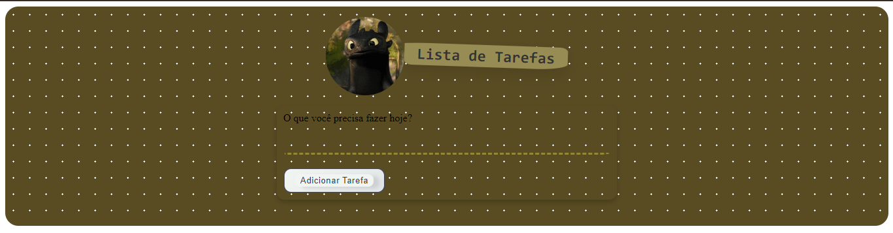

# To-Do List

Welcome to the To-Do List application! This project allows you to manage your tasks efficiently with a sleek and intuitive interface.

## Features

- **Add Tasks:** Easily add new tasks to your list with a user-friendly form.
- **Remove Tasks:** Delete tasks with a simple click on the delete button.
- **Responsive Design:** Optimized for both desktop and mobile views.

## Preview



## Getting Started

To get started with this project, follow the steps below:

### Prerequisites

Make sure you have a modern web browser. No additional software is required.

### Installation

1. **Clone the Repository:**

    ```bash
    git clone https://github.com/your-username/your-repository.git
    ```

2. **Navigate to the Project Directory:**

    ```bash
    cd your-repository
    ```

3. **Open the HTML File:**

    Simply open `index.html` in your browser to see the application in action.

## Usage

1. **Adding Tasks:**
   - Enter your task in the input field and click the "Add Task" button.
   
2. **Removing Tasks:**
   - Click the "Delete" button next to a task to remove it from the list.

## Styles

The styling of this project is designed to be both functional and aesthetically pleasing:

- **Background Colors:** 
  - Container: `#594C23`
  - List Items: `#988c55`
  - Button Background: `#2d2d2d`
  
- **Hover Effects:**
  - List Items: Darker shade for better visibility
  - Delete Button: Darker color on hover

## JavaScript

The JavaScript code provides dynamic functionality for the to-do list:

- **Add Task Functionality:** Handles form submission and updates the DOM.
- **Remove Task Functionality:** Deletes tasks from both the DOM and the internal array.
- **Multi-language Support:** Updated for consistent behavior in both English and Portuguese.

### Example Code

```javascript
// JavaScript code for handling task addition
form.addEventListener('submit', e => {
    e.preventDefault();
    const itemId = String(Date.now());
    const toDoItem = input.value.trim();
    
    if (toDoItem === '') return; // Prevent adding empty tasks

    addItemToDOM(itemId, toDoItem);
    addItemToArray(itemId, toDoItem);
    input.value = '';
});

## Contributing

Feel free to contribute by submitting a pull request or opening an issue. Contributions are welcome!

## License

This project is licensed under the MIT License. See the [LICENSE](LICENSE) file for details.

## Acknowledgements

- **Design Inspiration:** For design ideas and concepts.
- **JavaScript Resources:** For JavaScript tips and tricks.

